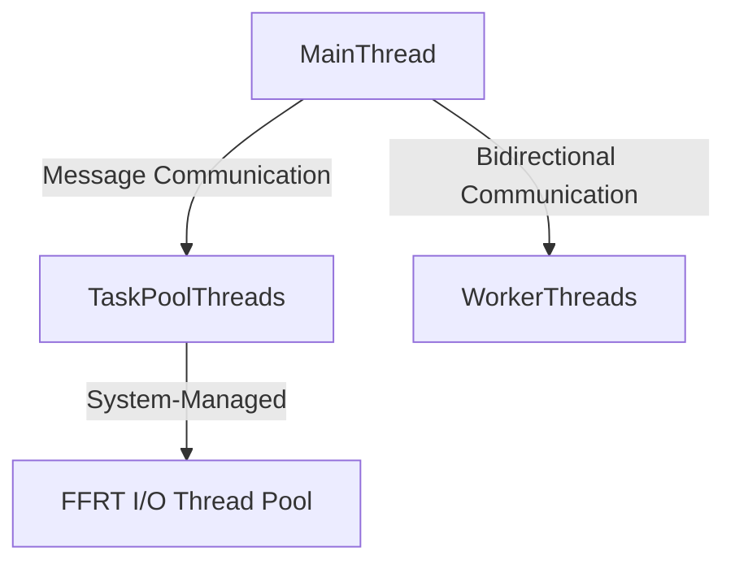

### 🌟 HarmonyOS Concurrent Programming Battle Guide: Unlocking ArkTS Multithreading Black Technology  

Hey developers! Today, I’m uncovering the concurrent programming treasures hidden in HarmonyOS official documentation—solutions for 100+ practical scenarios! Ranging from financial management to game development, foldable adaptation to performance tuning, these cases embody the hard-earned experience of Huawei engineers. I’ll guide you through HarmonyOS concurrent development with the most straightforward language and code examples!  


### 🚀 I. ArkTS Concurrent Model: A Revolutionary Design  
**Pain points of traditional models**  

**Typical performance**: Java apps often host hundreds of threads, with I/O blocking causing lag.  

**ArkTS's breakthrough solution**  

**Three core concepts**:  
1. **Memory isolation**: Direct object sharing between threads is prohibited.  
2. **Asynchronous I/O**: The system automatically distributes blocking operations to the background.  
3. **Auto-scaling**: TaskPool dynamically adjusts the number of threads based on load.  

💡 **Test comparison**:  
● Thread count on 8-core devices: Java averages 200+ vs. ArkTS only 7–15.  
● Memory footprint: Empty Worker thread ≈ 2MB.  


### 🔥 II. High-Frequency Scenario Battle (with Code Analysis)  
#### Scenario 1: Concurrent Time-Consuming Tasks—Image Decoding Acceleration  
**Pain point**: 4K image decoding on the main thread causes UI卡死 (freeze).  

```typescript  
// Step 1: Define a concurrent function  
@Concurrent  
function decodeImage(imageData: ArrayBuffer): Image {  
  // Use Native decoding library (non-blocking UI thread)  
  return nativeDecode(imageData);  
}  

// Step 2: Dispatch tasks to TaskPool  
function loadGallery() {  
  const imageTasks = imageList.map(img =>  
    taskpool.execute(decodeImage, img.rawData)  
  );  

  // Step 3: Batch retrieve results  
  Promise.all(imageTasks).then(decodedImages => {  
    updateUI(decodedImages); // Render decoded images  
  });  
}
```  
**Key techniques**:  
● Single data transfer < 200KB (1ms transfer time).  
● Avoid passing complex objects (requires serialization).  

#### Scenario 2: Foldable Hover State—Video Player Adaptation  
**Effect**: Video window automatically shrinks into the hover area when half-folded.  

```typescript  
// Listen for fold status  
display.on('foldStatusChange', (status) => {  
  if (status === display.FoldStatus.HALF_FOLD) {  
    // Enter hover mode  
    videoPlayer.enterHoverMode().then(() => {  
      // Dynamically adjust layout  
      this.videoContainer.width = '30%';  
      this.videoContainer.margin = { top: 70, bottom: 10 };  
    });  
  }  
});  

// Video component encapsulation  
@Component  
struct VideoPlayer {  
  @State inHoverMode: boolean = false  

  enterHoverMode() {  
    this.inHoverMode = true  
    // Trigger picture-in-picture logic  
  }  
}
```  

#### Scenario 3: Producer-Consumer Pattern—Reading APP Preloading  
**Requirement**: Pre-parse the next 5 pages in the background when turning pages.  

```typescript  
// Producer: Main thread dispatches parsing tasks  
function onPageTurn() {  
  for (let i=1; i<=5; i++) {  
    const task = new taskpool.Task(parsePage, nextPageData(i));  
    taskpool.execute(task).then(parsedPage => {  
      // Store results in the cache queue  
      PageCache.enqueue(parsedPage);  
    });  
  }  
}  

// Consumer: Fetch pages from cache for rendering  
@Concurrent  
function parsePage(rawData: PageData): Page {  
  // Complex parsing logic (time-consuming operation)  
  return new Page(rawData);  
}
```  
**Concurrent optimizations**:  
● Use `taskpool.TaskGroup` for batch task management.  
● Priority settings: Current page > Next page > Subsequent pages.  


### ⚡ III. Advanced Techniques: Pitfall Avoidance Guide  
#### Trap 1: Worker Thread Leak  
**Wrong example**:  
```typescript  
// Forgetting to close Worker causes memory spikes  
function processData() {  
  const worker = new worker.ThreadWorker('worker.js');  
  worker.postMessage(largeData);  
  // Forgot worker.terminate()!  
}
```  
**Correct solution**:  
```typescript  
worker.onmessage = () => {  
  // ...Process data then immediately close  
  worker.terminate();   
}
```  

#### Trap 2: Modifying Shared Objects Across Threads  
**Dangerous operation**:  
```typescript  
// Main thread  
const config = { theme: 'dark' };  
taskpool.execute(modifyConfig, config);  

@Concurrent  
function modifyConfig(cfg) {  
  cfg.theme = 'light'; // Throws an exception!  
}
```  
**Safe solution**:  
```typescript  
// Use deep copy or freeze objects  
const safeConfig = Object.freeze({ ...config });
```  


### 🛠️ IV. Performance Tuning Tools  
#### 1. Long list lag optimization  
```typescript  
// Frame-by-frame rendering: 50ms per frame  
@State @TrackItem items: Array<Item> = []  

loadData() {  
  for (let i=0; i<1000; i++) {  
    if (performance.now() - start > 50) {  
      setTimeout(this.loadData, 0) // Continue in the next frame  
      return  
    }  
    items.push(newItem)  
  }  
}  

// Component reuse  
@Component  
struct ListItem {  
  @TrackItem item: Item  

  aboutToReuse(params) {  
    this.item = params.item // Reuse instance  
  }  
}
```  
**Test effect**: Huawei Mate XT list FPS increased from 22→58.  

#### 2. Memory leak detection  
```bash  
# Use HWAsan to detect Native layer memory leaks  
hdc shell setenforce 0  
hdc shell setprop hwaps.debug true
```  
**Key log identifiers**:  
`[HWASAN] ERROR: heap-use-after-free`  


### 💎 V. Summary: Best Practice Roadmap  
```mermaid  
journey  
  title HarmonyOS Concurrent Development Decision Tree  
  section Task Type  
    Short-Term Tasks --> TaskPool: Image Decoding / JSON Parsing  
    Long-Term Tasks --> Worker: Game Logic / Socket Listening  
  section Special Requirements  
    Sequential Execution --> SequenceRunner  
    Dependency Management --> addDependency  
    Batch Processing --> TaskGroup  
```  

**Final advice**:  
HarmonyOS's concurrent model is designed for distribution. Mastering these cases will help you:  
● No more headaches with foldable/multi-device adaptation.  
● Clear paths for performance tuning.  
● Clean decoupling of complex business logic.  

Encountered pitfalls? Feel free to discuss! If this helps, remember to like and save 🌟
